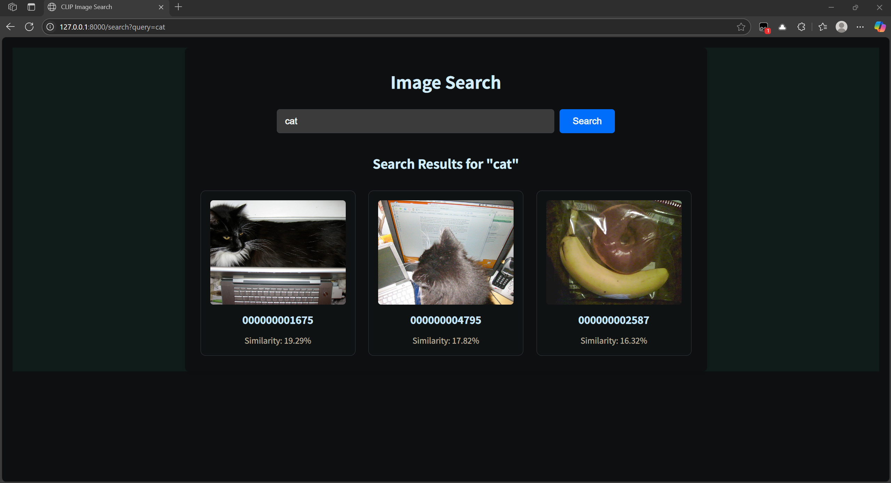

# OpenCLIP Model Image-Text Retrieval System

## A Demonstration of Using OpenCLIP's Pre-trained Models

**Project Description**:

I attempted to reproduce and train a lightweight MiniCLIP model (code located under `/MiniCLIP`) to implement the basic functionality of CLIP (Contrastive Language-Image Pre-training), including dual encoding capabilities for images/text and multimodal contrastive learning. However, due to limited computational resources (RTX 3060 laptop GPU) and lack of experience, the model failed to converge properly.

As an alternative solution, I utilized the RN50 model from OpenCLIP (with a simplified ResNet18 as the image encoder for visual feature extraction), which can run effectively on my hardware. Based on this, I developed:

1. A simple web interface with HTML/JavaScript for user interaction
2. A Flask-based backend API service
3. Image-text matching functionality with similarity score visualization

**System Requirements**:
- Python 3.7+
- NVIDIA GPU (recommended for better performance)

**Setup Instructions**:

1. Prepare your image dataset:
   - Option A: Create a `local_images` directory and populate it with your target images (I used CIFAR-10 dataset)
   - Option B: Use the included `datascraping.py` tool to download images from specified URLs

2. Install dependencies:
   ```bash
   pip install -r requirements.txt
   ```
   
3. Launch the application:
   ```bash
   python main.py
   ```
   

4. Access the web interface:
   - Open http://127.0.0.1:8000 in your browser
   
   
   
**Key Features**:

Real-time image-text matching

Similarity score visualization

Lightweight ResNet18-based image encoder

Cross-modal retrieval capability
